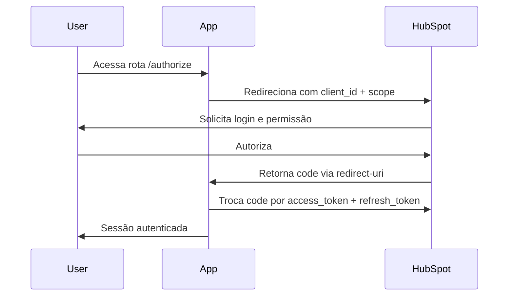

# 📘 Documentação Técnica — Integração HubSpot

## 📂 Estrutura do Projeto

```
hubspot-meetime/
│
├── src/
│   └── main/
│       ├── java/com/meetime/hubspot/
│       │   ├── config/             # Configurações gerais (OAuth2, Security)
│       │   ├── controller/         # Endpoints REST
│       │   ├── service/            # Lógica de negócio
│       │   ├── model/              # DTOs e modelos de domínio
│       │   ├── repository/         # Persistência (Spring Data JPA)
│       └── resources/
│           └── application.properties
│
├── docs/                           # Documentações e diagramas
├── pom.xml                         # Dependências Maven
└── README.md
```

---

## 🧱 Arquitetura

A aplicação segue o padrão **camada MVC com serviços**, desacoplando responsabilidades:

- **Controller:** responsável por expor as rotas públicas e privadas da aplicação.
- **Service:** executa as regras de negócio e interações com o HubSpot.
- **Model/DTO:** representa os dados da aplicação e objetos externos.
- **SecurityConfig:** controla o acesso baseado em roles, utilizando OAuth2.
- **Repository:** persistência de dados em banco relacional (PostgreSQL ou H2).

---

## 🔐 Autenticação OAuth2

A autenticação é feita via **HubSpot OAuth2 Authorization Code Flow**.

### 🔄 Fluxo:



---

## 🧪 Endpoints REST

| Método | Rota                        | Descrição                           | Autorização |
|--------|-----------------------------|-------------------------------------|-------------|
| GET    | `/hello`                    | Endpoint de teste                   | Público     |
| GET    | `/api/contacts`             | Lista contatos do HubSpot           | Privado     |
| POST   | `/api/contacts`             | Cria um novo contato                | Privado     |
| POST   | `/webhook/hubspot`          | Recebe eventos de webhook do HubSpot| Público     |

---

## 📄 Swagger

A documentação Swagger é gerada automaticamente.

Acesse em:  
[`http://localhost:8080/swagger-ui/index.html`](http://localhost:8080/swagger-ui/index.html)

---

## 🧾 application.properties

Exemplo de configuração:

```properties
spring.security.oauth2.client.registration.hubspot.client-id=SEU_CLIENT_ID
spring.security.oauth2.client.registration.hubspot.client-secret=SEU_CLIENT_SECRET
spring.security.oauth2.client.registration.hubspot.redirect-uri=http://localhost:8080/login/oauth2/code/hubspot

spring.datasource.url=jdbc:postgresql://localhost:5432/hubspot
spring.datasource.username=postgres
spring.datasource.password=admin
```

---

## 🗃️ Banco de Dados

A estrutura básica inclui tabelas para controle de usuários, permissões e logs de integração (opcional).

**Exemplo de Entidade:**

```java
@Entity
public class Usuario {
    @Id
    private Long id;
    private String nome;
    private String email;
    private String role;
}
```

---

## 📈 Futuras Extensões

- Envio de mensagens via WhatsApp API.
- Agendamento de sincronizações automáticas.
- Dashboards analíticos com Power BI.
- Integração com múltiplas contas HubSpot.

---

## 🧑‍💻 Autor
```
Desenvolvido por **Josevan Oliveira**  
LinkedIn: [josevanoliveira](https://www.linkedin.com/in/josevanoliveira/)  
Email: josivantarcio@msn.com
```
